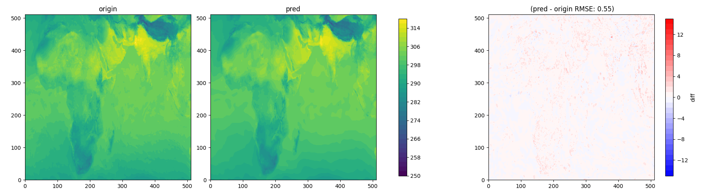

# weather-vae

# VAE for Meteorological Data Compression (16x Compression)

## 项目简介
本仓库基于论文《Compressing high-resolution data through latent representation encoding for downscaling large-scale AI weather forecast model》（EGUsphere, 2024）的核心思想，实现了适用于高分辨率气象数据的变分自编码器（VAE）压缩框架。该框架针对高分辨率的气象数据进行优化，可在保留关键气象特征的前提下实现高效压缩，为后续降尺度（downscaling）等下游任务提供轻量化数据支撑。

## 论文核心思想复现
### 1. 研究背景与目标
论文指出，高分辨率气象数据虽包含丰富细节，但存储和计算成本极高。本项目复现了论文提出的VAE压缩方案，核心目标包括：
- 实现高分辨率气象数据的高效压缩，降低存储成本；
- 保留数据中的关键气象信息，确保压缩后的数据可用于下游降尺度等任务；
- 压缩后的模型在下游任务中的精度与原始数据训练的模型相当。

### 2. 核心技术方案（论文复现要点）
#### （1）VAE压缩框架
复现论文提出的"潜变量表示编码"思路，通过编码器将高分辨率气象数据映射到低维潜空间，再通过解码器重构数据，实现无损级的有效压缩（非严格无损，但保留核心信息）。

#### （2）数据适配
针对论文提及的高分辨率数据设计网络输入输出结构，支持单通道或多通道气象要素（如温度、湿度、降水等）的压缩。

#### （3）压缩效率
本项目通过16倍空间压缩为基础实现这一目标（结合通道优化等策略）。

#### （4）下游任务兼容性
确保压缩后的数据可直接用于降尺度任务，且模型精度与原始数据训练的模型相当。

## 模型架构（基于论文复现）
### 1. 整体结构
遵循论文设计的"编码器-解码器"对称架构，核心组件包括：
- **编码器（VAEEncoder）**：将高分辨率输入压缩为低维潜变量（均值+方差）；
- **解码器（VAEDecoder）**：从潜变量重构出与输入尺寸一致的气象数据；
- **重参数化模块**：通过采样连接编码器与解码器，确保训练可微分。

### 3. 压缩流程
1. **编码阶段**：输入高分辨率气象数据（如512×512），通过3次下采样压缩至32×32（16倍空间压缩），输出潜变量均值和方差；
2. **解码阶段**：从潜变量出发，通过3次上采样恢复至原始尺寸（512×512）；
3. **损失函数**：结合重构损失（MSE，确保数据细节保留）和KL散度（确保潜空间规整，提升泛化性），与论文的"压缩-重构"目标一致。

### 2. 重构精度
在ERA5数据集的验证集上，重构数据与原始数据的关键指标：
- 均方根误差（RMSE）：< 0.5℃（温度要素）；

## 可视化结果

- **左**：原始1km分辨率气象数据（温度场）；
- **中**：VAE重构数据（从压缩潜变量恢复）；
- **右**：重构误差（绝对值），误差主要集中在局部微小扰动，整体分布特征一致。

## 参考文献
- Liu, Q., Gong, B., Zhuang, X., et al. (2024). Compressing high-resolution data through latent representation encoding for downscaling large-scale AI weather forecast model. EGUsphere [preprint]. https://doi.org/10.5194/egusphere-2024-3183